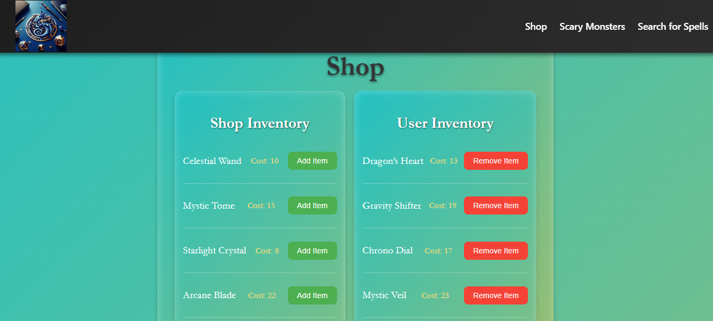
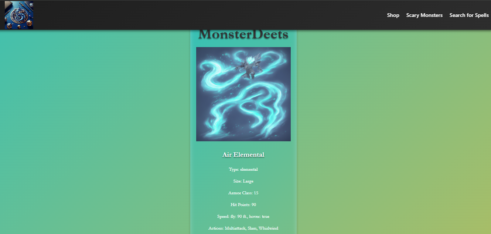
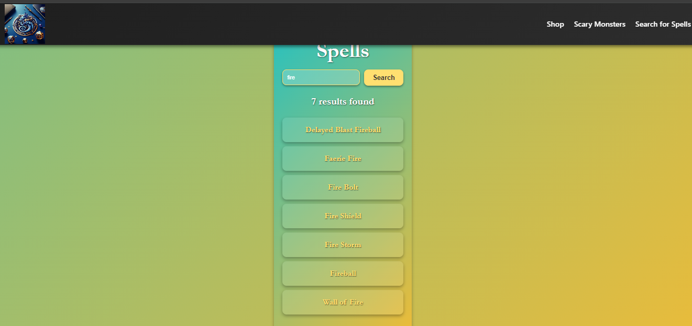

# React DnD FE 🎲

An engaging front-end application built with React and Vite, featuring a shop for magical items, a list of monsters, and a spell search functionality. Dive into a magical world with detailed views and an interactive shop!

## 🎮 Features
- **Shop Interface:** Add or remove magical items to and from your inventory.
- **Monster List & Details:** Explore a list of monsters and view detailed information about each one.
- **Spell Search & Details:** Search for spells and get detailed descriptions and properties.
- **Responsive Design:** Adapts well to various screen sizes.

## 🛠️ Project Link
### Click **[here](https://example.com)** to access the project (replace with actual link).

## 🚀 How to Use
1. **Explore the Shop:** View and manage magical items in the shop.
2. **Browse Monsters:** Check out the monster list and click on any monster for detailed information.
3. **Search Spells:** Use the search form to find spells and view their details.

## 📂 Technology Used

 
 
 

 
 

 

## 📷 Preview

### Shop

*Discover enchanted items and magical artifacts in our mystical marketplace.*

### Monsters

*Encounter legendary creatures and mythical beasts from another realm.*

### Spells

*Cast powerful spells from a magical grimoire and harness arcane energy.*

## 💡 Acknowledgments
- [Ben Manley](https://github.com/ManliestBen) for his engaging ed-tech content and sharing helpful resources like [D&D API](https://sei-dnd-api.herokuapp.com) for the monster and spell data.

## 🔮 Future Enhancements

* Integrate a user authentication system for saving inventory and preferences.
* Implement a filter system for searching monsters and spells.
* Add sorting options for the shop inventory.
* Enhance UI/UX with more animations and interactive elements.
